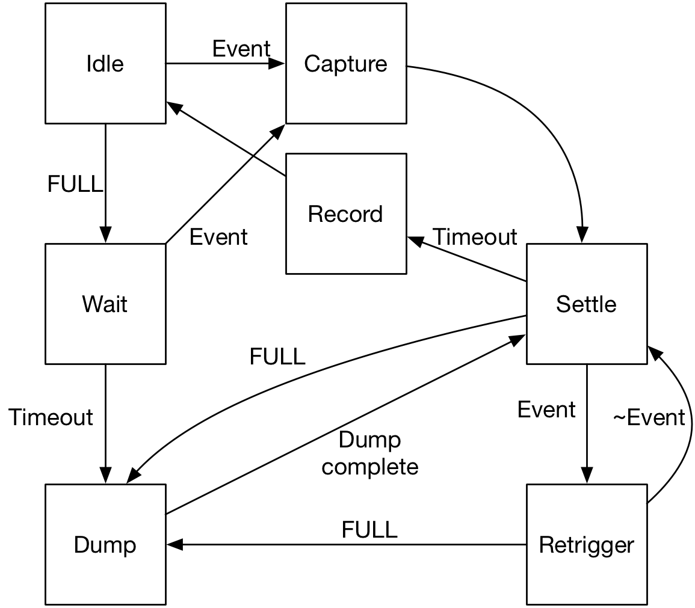

# Mcadam FPGA ICD
Draft of June 24, 2019

John P. Doty, Noqsi Aerospace Ltd
## Interface Signals and Voltages
Signals are digital, 3.3V CMOS, positive logic.

**AE** is analog electronics.

### Per-detector signals (two of each)

* **FASTTRIG**, **SLOWTRIG** (AE->FPGA) A pulse has risen above threshold.
* **FASTZX**, **SLOWZX** (AE->FPGA) After the corresponding **TRIG** has been asserted, a rising edge of **ZX** occurs at the moment that the filtered pulse amplitude peaks. This is when the ADC acquisition cycle should start.
* **OVERSHOOT** (AE->FPGA) Diagnoses analog overload.
* **FULL** (AE->FPGA) This indicates that the charge integrator in the detector is (nearly) full. The FPGA state machine should issue a **DUMP** pulse. Recording such events is useful for measuring total detector current, radiation plus dark leakage.
* **DUMP** (FPGA->AE) Dump the charge from the SDD's charge integrator. 5 µs, 3.3V pulse.
* **FASTCNV**, **SLOWCNV** (FPGA->AE) ADC convert command.
* **FASTSDO**, **SLOWSDO** (AE->FPGA) ADC serial data.
* **SYNC/** (FPGA->AE) DAC enable.

### Signals common to both detectors
* **SCK** (FPGA->AE) ADC clock.
* **SCLK** (FPGA->AE) DAC clock.
* **DIN** (FPGA->AE) DAC serial data.
* **DOUT** (AE->FPGA) HK ADC data.
* **HK0** (FPGA->AE) Housekeeping address bit 0.
* **HK1** (FPGA->AE) Housekeeping address bit 1.
* **HK2** (FPGA->AE) Housekeeping address bit 2.
* **HKSEL0/** (FPGA->AE) Housekeeping mux select.
* **HKSEL1/** (FPGA->AE) Housekeeping mux select.
* **HKSEL2/** (FPGA->AE) Housekeeping mux select.
* **HKCS/** (FPGA->AE) Housekeeping ADC enable.

## State Machine for Pulse Acquisition
Here, **Event** refers to the logical OR of **FASTTRIG**, **SLOWTRIG**, and **OVERSHOOT**.

There one such state machine per SDD.

### State: *Idle*
* Entered from *Record*. This is also the initial state.
* Exit: *Capture*, driven by **Event**.
* Exit: *Wait*, driven by **Full**.

This is the usual resting state between incoming photons and charge dump events.
### State: *Capture*
* Entered from *Triggered*.
* Exit: *Settle*.

This is the main data aquisition state, where a number of activities take place in parallel. More details below.

The dead time counter is active in the *Capture* state.

The *Capture* state captures the time in `event_time`. More details below.

### State: *Settle*
* Entered from *Capture*, *Dump*, and *Retrigger*
* Exit: *Retrigger*, driven by **Event**.
* Exit: *Dump*, driven by **FULL**.
* Exit: *Record*, after 10 (TBR) µs.

The purpose of this state is to wait for the shaping filter to settle down after a photon detection or charge dump event.

The dead time counter is active in the *Settle* state.

### State: *Record*
* Entered from the *Settle* state.
* Exit: *Idle*

This records the event data. Once recorded, clears the event data.

### State: *Retrigger*
* Entered from *Settle*
* Exit: *Dump*, driven by **FULL**.
* Exit: *Settle*, driven by **Event** low.

This handles the case where the shaping filter doesn't settle on schedule, either because it's recovering from an overload or an interval between photons too short for it.

The dead time counter is active in the *Retrigger* state.

### State: *Wait*
* Entered from *Idle*
* Exit: *Triggered*, driven by **Event**.
* Exit: *Dump*, after 3 (TBR) µs.

Sometimes, the charge accumulated in the detector charge integrator exceeds the DUMP threshold because a photon, rather than dark current, pushes it over. In this case, **Event** will be asserted shortly after **FULL**. This state waits for such a trigger, allowing the pulse height capture process to proceed before dumping the charge in this case.
### State: *Dump*
* Entered from *Wait*, *Settle*, and *Retrigger*.
* Exit: *Settle*, after 5 (TBR) µs.

This should assert **DUMP** for the duration of this state.

The *Dump* state sets `dump` in the event code.

The dead time counter is active in the *Dump* state.

If the *Dump* state is entered from *Wait*, it captures the time in `event_time`. Otherwise, `event_time` should already have been set by *Capture*.

## The Capture State
The *Capture* state involves three processes that occur in parallel:

1. Watch for **FASTTRIG** asserted. If it is, the following rising edge of **FASTZX** should immediately trigger a rising edge of **FASTCNV**. Once the conversion is complete, the fast ADC data should be read out and saved.
2.  Watch for **SLOWTRIG** asserted. If it is, the following rising edge of **SLOWZX** should immediately trigger a rising edge of **SLOWCNV**. Once the conversion is complete, the slow ADC data should be read out and saved.
3. Watch for **OVERSHOOT** asserted. If it is, set the `overshoot` flag in the event code.

`event_time` should be set to the time of the assertion of **FASTCNV**, **SLOWCNV**, or **OVERSHOOT**, whichever comes first.

Exit the **Capture** state once **Event** is deasserted and any acquisition triggered by **FASTTRIG** and **SLOWTRIG** is complete.

## Raw Event Encoding
This section delves a short distance beyond the interface into what the FPGA captures. This does not represent the final encoding into events in packets. The number of bits and time resolution are TBD, with NICER's implementation as reference here.

* `event_time`
* `dead_time`

For NICER, these are 16 bit values, with ~40 ns resolution in hardware. `event_time` is common to both detectors and counts continuously, with overflows handled in software. In addition to recording the `event_time` for each SDD event, the FPGA should record the `event_time` for each GPS PPS pulse.

`dead_time` is per detector, held at zero in the *Idle* and *Wait* states, actively counting in the other states.

* `fast_trigger`
* `slow_trigger`
* `overshoot`
* `dump`

These are one bit flags characterizing the event.

* `fast_ph`
* `slow_ph`

For NICER, these are 16 bit quantities. While the ADC is capable of 18 bit resolution, we only use 16 bits of it.

